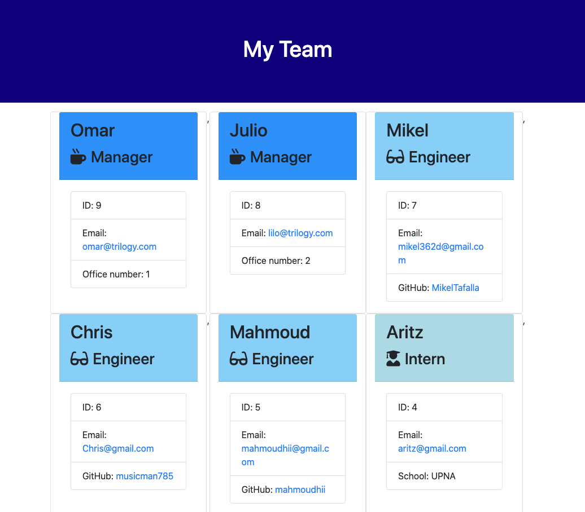

# Employee_Template_Engine

Create a command-line application that dynamically generates an html file named team.html from a user's input. The user will be prompted for information pertaining to the team and an html containing cards with the information of each employee will be generated. The employee-types this app creates are Manager, Engineer, Interns.

# Technologies Used

1. Node.js (CLI)
2. Bootstrap
2. NPM
3. ES6

# Table of Contents

* [Installation](#installation)
* [Instructions](#instructions)
* [Tests](#tests)
* [Example Gif](#example-gif)
* [Result](#result)
* [Author](#author)

## Installation
> 1.npm init // 2.npm install
> If issues appear: npm install inquirer // npm install jest (to be able to run tests)
## Instructions
> Open your terminal and go inside the repo where the app.js is located. Type node app.js in your terminal and answer all the prompted questions. After you finish adding all employees a team.html file will be generated on the output folder. If you need to modify your team, run the app again and the file would be overwritten.
## Tests
> npm run test 
> Result should be 4 suites passed, 17 issues passed

### Example Gif

### Result

## Author 

**MikelTafalla**

Email: mikel362d@gmail.com

Location: Santa Barbara

GitHub: https://github.com/MikelTafalla
